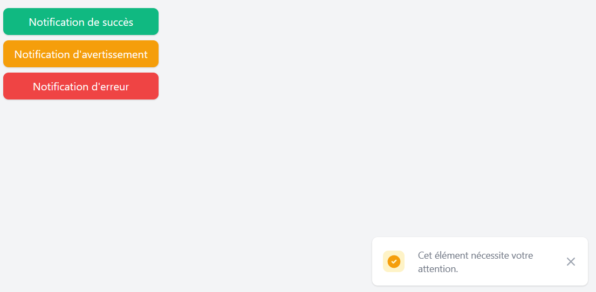
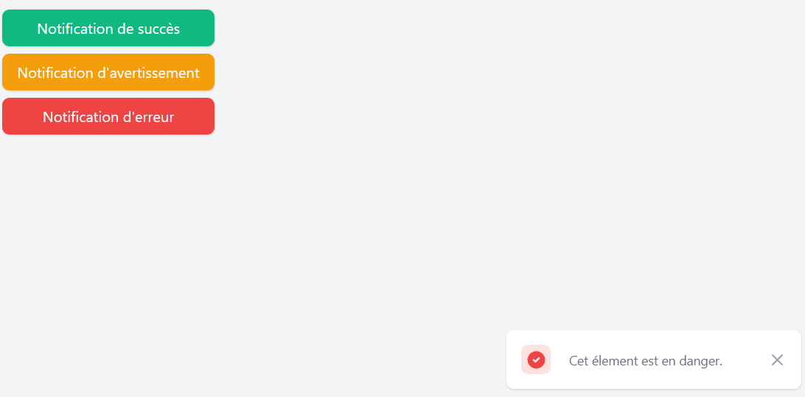

# BasicTailwindToastify

Ce dépôt contient une implémentation simple et basique des notifications de type "success" (succès), "warning" (avertissement) et "danger" (erreur) utilisant TailwindCSS.

# Prévualisation

# Prérequis

Avant de commencer, assurez-vous d'avoir un navigateur moderne tel que Chrome, Edge, etc. pour exécuter l'application.

# Utilisation

1. Téléchargez le code source de ce projet en cliquant sur le bouton `Code` en haut de cette page, puis en sélectionnant `Download ZIP`.
2. Extrayez le contenu du fichier ZIP téléchargé sur votre machine.
3. Ouvrez le fichier `index.html` dans votre navigateur pour voir les boutons de notification.
4. Cliquez sur les boutons respectifs pour déclencher les notifications correspondantes.

N'hésitez pas à personnaliser les styles et à explorer le code pour mieux comprendre comment les notifications sont créées et affichées.

# Personnalisation
Si vous souhaitez personnaliser les styles des notifications, vous pouvez le faire en modifiant les classes CSS dans le fichier index.html. Assurez-vous de consulter la documentation de TailwindCSS pour en savoir plus sur la personnalisation des styles.

# Structure du projet
Le projet est organisé de la manière suivante :

- `index.html` : Fichier HTML contenant les boutons et les scripts pour afficher les notifications.
- `tailwind.min.css` : Fichier CSS contenant les styles de base de TailwindCSS.
- `index.js` : Fichier JavaScript contenant la logique pour créer et afficher les notifications.

# Licence

Ce projet est sous licence MIT. Voir le fichier LICENSE pour plus de détails.